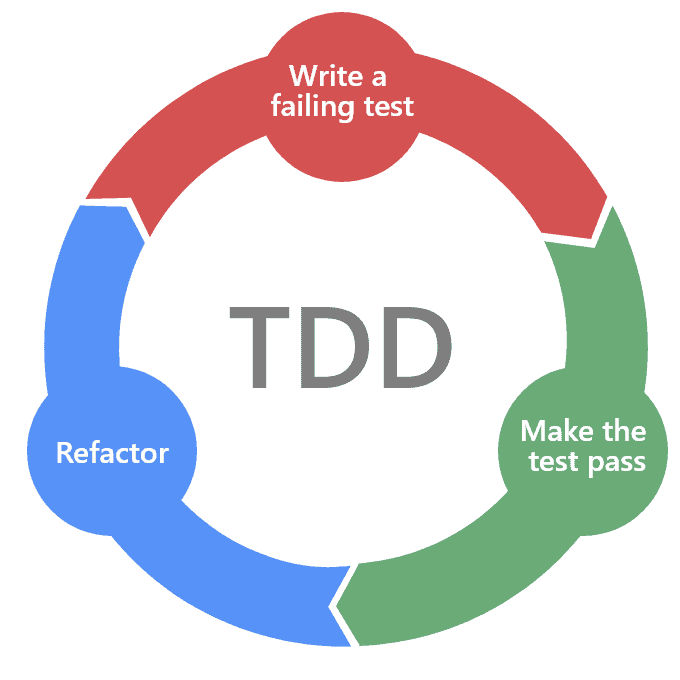

# Go Study Group

## Sesión 1: Introducción a Go

### 10 de Marzo, 2021


---

# ¿Qué es Go? 🤔

Es un lenguaje de programación compilado. Un software llamado compilador traduce código fuente a código máquina (ejecutable).

```shell
go build main.go -o greeter_app
./greeter_app
# Hello, World!
```

--- 

# ¿Qué es Go? 🤔 (II)

Estáticamente tipado: el compilador comprueba que todos los tipos coinciden con las operaciones que el programa realiza.

```go
package main

func main(){
	var number int
	number = 3
	number += " little pigs" // type error
	...
}
```

--- 

# ¿Qué es Go? 🤔 (III)

Sintácticamente similar a C pero más seguro en gestión de memoria:

- Punteros, pero sin aritmética de punteros
- Garbage Collection

A veces llamado "el C del siglo XXI", otras veces como "C--". 🤷‍♂️

---

# ¿Qué es Go? 🤔 (IV)

Herramientas de desarrollo out-of-the-box:

- Testing
- Concurrencia (con channels)
- Gestión de dependencias
- Formato, etc.
---

# Tema del día: Test-Driven Development (TDD)

- Proceso iterativo de desarrollo de software.
- Escribimos código solo para hacer pasar tests escritos anteriormente.
- Escribir soluciones simples revela patrones ➡️ al detectarlos podemos refactorizar.
- Refactor: modificación de código ya existente para mejorarlo.



---
# ¿Por qué TDD?

- Nos concentramos en unidades de código. Dividir y conquistar.
- Nos da confianza: aquello que desarrollamos está cubierto por los tests.
- Nos ayuda a detectar cambios que rompen otras funcionalidades ➡️ evitamos introducir bugs
- Tests bien escritos pueden describir nuestro código. Facilita onboarding.
