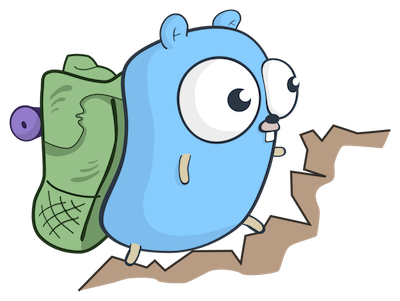

# Go Study Group

## Sesión 2: Structs y métodos

### 7 de abril, 2021



---
# ¿Qué es un struct?

Un _struct_ es un tipo de datos compuesto de varios valores, que puede ser tratado como una sola unidad.

Normalmente se le asigna un nombre a un struct, para reutilizarlo en varios puntos de un programa.

```go
import "time"

// Record represents information about a record.
type Record struct {
	Name        string
	Artist      string
	ReleaseDate time.Time
}
```

---
# Structs anónimos

Un struct puede ser también "anónimo", es decir, sin nombre. Solo puede utilizarse en el momento en el que se lo declara.

```go
var session = struct {
    name    string
    topic   string
    session int
}{
    name:    "Go Study Group",
    topic:   "structs y métodos",
    session: 2,
}

```

---
# Structs anónimos II

```go
package store

func TestTableGreeter(t *testing.T) {
	tests := []struct {
		testName string
		language language
		want     string
	}{
		{testName: "greets in English", language: English, want: "Hello, Go Study Group"},
		{testName: "greets in Spanish", language: Spanish, want: "Hola, Go Study Group"},
		{testName: "greets in Italian", language: Italian, want: "Ciao, Go Study Group"},
	}
	const name = "Go Study Group"
	for _, test := range tests {
		t.Run(test.testName, func(t *testing.T) {
			got := Greeter(name, test.language)

			if got != test.want {
				t.Errorf("want %s, got %s", test.want, got)
			}
		})
	}
}
```

---
# Uso de mayúsculas/minúsculas

Las palabras que comienzan con mayúscula son de acceso público (pueden ser accedidas desde fuera).
A su vez, las que comienzan con minúscula son de acceso privado (no pueden ser accedidas desde fuera).

```go
package store

type Customer struct {} // público

type stock struct {} // privado

type Record struct {
	Name string // público
	copies int  // privado
}
```

---
# Structs y funciones

Al definir un struct, introducimos un nuevo tipo de datos. Pueden ser parámetro o valor de retorno de funciones.

```go
func DaysSinceRelease(r Record) float64 {
    return time.Since(r.releaseDate).Hours() / 24
}

func ReleaseNewRecord(name, artist string, artCover Image) Record {
    return Record{
		Name: name,
		Artist: artist,
		ReleaseDate: time.Now(),
		ArtCover: artCover
	}
}
```

---
# OOP y Métodos

Go da soporte a programación orientada a objetos uniendo funciones (métodos) a structs.

```go
func (r Record) DaysSinceRelease() float64 {
    return time.Since(r.ReleaseDate).Hours() / 24
}

r = Record{}
r.DaysSinceRelease()
```

---
# OOP y Métodos II

Go no soporta clases ni herencia. Sin embargo, podemos hacer uso de los siguientes recursos en su lugar:

1. composición,
2. _embedding_ 
3. interfaces

---
# Composición

Podemos anidar structs dentro de otros, como campos. Esto nos permite definir structs compuestos.

```go
type Image struct {
    Url string
}

type Record struct {
    ArtCover Image
}

var record = Record{
    Name:        "Animals",
    Artist:      "Pink Floyd",
    ArtCover:    Image{Url: "..."},
}
```

---
# _Embedding_

Podemos anidar structs sin declarar un nombre de campo. Esto hace que el struct contenedor "adquiera" los campos y métodos del contenido.

```go
type Ball struct {
    Radius   int
    Material string
}

func (b Ball) Bounce() {
    fmt.Printf("Bouncing ball %q", b)
}

type Football struct {
    Ball
}

fb := Football{}
fb.Bounce()
```

---
# Interfaces

Una interfaz es una colección de _firmas_ de métodos, también conocido como un contrato. También define un tipo.

En Go, un struct _implementa_ una interfaz si implementa todos los métodos del contrato.

En Go, no son necesarias keywords como _extends_.

---
# Interfaces II

```go
type CoffeeMaker interface {
    Brew()
}

type FrenchPress struct{}

func (f FrenchPress) Brew() {
    fmt.Println("brewing with a french press")
}

type Moka struct{}

func (m Moka) Brew() {
    fmt.Println("brewing with a moka")
}

for _, maker := range []CoffeeMaker{FrenchPress{}, Moka{}} {
    maker.Brew()
}
```

---
# Kata: Record Store

Una tienda de discos de música nos pide implementar un sistema para administrar su stock. Este debe permitir:

- Comprar un disco
    - Cada compra decrementa la cantidad de copias en 1.
    - Si no hay más stock, notificar.
- Calcular el precio de un disco, teniendo en cuenta si tiene descuento.
- Ver detalle de un disco del catálogo.

---
# Recursos

- Go by example: structs https://gobyexample.com/structs
- Kata sobre Structs, métodos e interfaces https://quii.gitbook.io/learn-go-with-tests/go-fundamentals/structs-methods-and-interfaces
- Katas + slides https://github.com/isaporiti/go-study-group

---
# Consultas y sugerencias

- https://twitter.com/codurance_ES
- ignacio.saporiti@codurance.com
