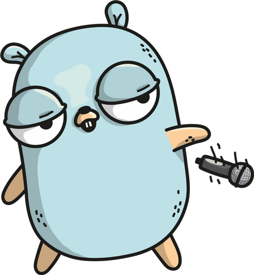

# Go Study Group

## Sesión 2: Structs, métodos e interfaces

### 7 de abril, 2021



---

# ¿Qué es un struct?

Un _struct_ es una colección tipada de campos. Nos sirven para agrupar datos dentro de un mismo tipo.

```go
package main

import "time"

type Record struct {
	name        string
	artist      string
	releaseDate time.Time
}

r := Record{
    name:        "Animals",
    artist:      "Pink Floyd",
    releaseDate: date(1977, time.January, 23),
}
```

---
# Struct _nesting_ (anidamiento)

Se pueden anidar structs dentro de otros, como campos. Esto nos permite hacer composición de structs.

```go
type Image struct {
    url string
}

type Record struct {
    artCover Image
}

r := Record{
    artCover: Image{
        url: "https://classic-albums.com/animals.jpg",
    },
}
```

---
# Structs y funciones

Al definir un struct, estamos definiendo un tipo de datos nuevo. Podemos aceptarlos como parámetro o valor de retorno de
funciones.

```go
func daysSinceRelease(r Record) float64 {
    return time.Since(r.releaseDate).Hours() / 24
}

func newRecord(name, artist string, artCover Image) Record {
    return Record{
		name,
		artist,
		time.Now(),
		artCover
	}
}
```

---
# Métodos

Go soporta programación orientada a objetos mediante la unión de funciones (métodos) a structs. No soporta clases ni herencia.

```go
func (r Record) daysSinceRelease() float64 {
    return time.Since(r.releaseDate).Hours() / 24
}
r = Record{...}
r.daysSinceRelease()
```

---
# Recursos

- Cómo instalar Go: https://go.dev/doc/install
- Documentación oficial del paquete _testing_: https://pkg.go.dev/testing
- Learn Go with Tests: https://quii.gitbook.io/learn-go-with-tests/
- Katas + slides: https://github.com/isaporiti/go-study-group

---
# Consultas y sugerencias

- https://twitter.com/codurance_ES
- ignacio.saporiti@codurance.com
